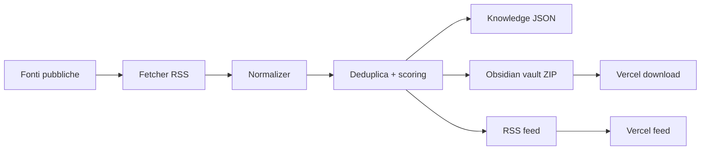

# RAGOSINT

RAGOSINT e' una pipeline OSINT/RAG-ready per un gruppo di ingegneri che vuole trasformare fonti pubbliche italiane in intelligence operativa.

Il progetto non e' solo scraping: recupera fonti ufficiali, le normalizza, le indicizza, le organizza semanticamente in un brain Obsidian e pubblica aggiornamenti consultabili come alert, report e feed RSS su Vercel.

## Canali RSS

- Normativa: `/feed/normativa.xml`
- Bandi: `/feed/bandi.xml`
- Aggregato: `/feed.xml`

## Obsidian brain scaricabile

Vercel genera una vault Obsidian completa in formato ZIP. Scaricala, estraila e apri la cartella con Obsidian per visualizzare grafo, tag, backlink, fonti e cluster.

- Brain completo: `/api/brain.zip`
- Brain normativa: `/api/brain/normativa.zip`
- Brain bandi: `/api/brain/bandi.zip`

Ogni ZIP contiene:

- note Markdown per alert, fonti, tag e canali;
- frontmatter YAML;
- link interni `[[...]]` per il grafo Obsidian;
- configurazione `.obsidian/` con grafo e plugin base.

API equivalenti:

- `/api/rss/normativa`
- `/api/rss/bandi`
- `/api/alerts?channel=normativa`
- `/api/alerts?channel=bandi`
- `/api/report?channel=normativa`
- `/api/search?q=cloud&channel=bandi`

## Fonti iniziali

### Normativa

- Gazzetta Ufficiale - Serie Generale
- Gazzetta Ufficiale - Corte Costituzionale
- Gazzetta Ufficiale - Unione Europea
- Gazzetta Ufficiale - Regioni

### Bandi, gare e PNRR

- Gazzetta Ufficiale - 5a Serie Speciale Contratti Pubblici
- Italia Domani - Amministrazioni Titolari
- Italia Domani - Soggetti Attuatori
- PNRR Cultura - Bandi e Avvisi

Le fonti sono configurate in `src/data/sources.json`.

## Architettura



## Knowledge base

Lo script di ingest genera:

- `data/knowledge/items.json`
- `data/knowledge/bandi.json`
- `data/knowledge/normativa.json`
- `data/knowledge/index.json`
- `brain/RAGOSINT - Index.md`
- `brain/RAGOSINT - Bandi.md`
- `brain/RAGOSINT - Normativa.md`

`data/knowledge/index.json` contiene chunk gia' pronti per un retriever vettoriale.

La vault scaricabile viene invece generata runtime da `src/lib/obsidian.ts` e compressa da `src/lib/zip.ts`, senza database e senza storage persistente.

## Avvio locale

```bash
pnpm install
pnpm run ingest
pnpm run dev
```

## Verifiche

```bash
pnpm run typecheck
pnpm run lint
pnpm run build
```

## Deploy Vercel

Impostare:

```bash
NEXT_PUBLIC_SITE_URL=https://rssmonitorbandi.vercel.app
```

`vercel.json` contiene un cron giornaliero su `/api/refresh`, compatibile con il piano Hobby gratuito.

## Roadmap

- aggiungere fonti ANAC, MEPA, enti regionali, universita', comuni e ASL;
- estrarre scadenze, importi, CIG/CUP, requisiti, soggetti beneficiari;
- aggiungere embeddings e vector store;
- collegare il brain Obsidian alla ricerca semantica;
- generare alert personalizzati per profili aziendali o aree di competenza;
- integrare notifiche Telegram, email o Slack.
