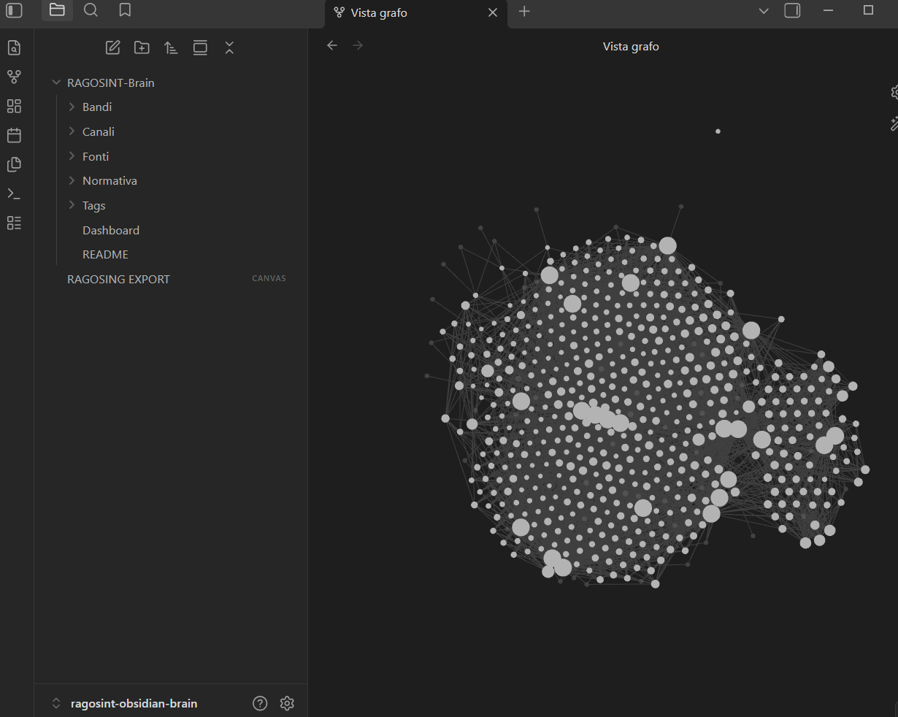
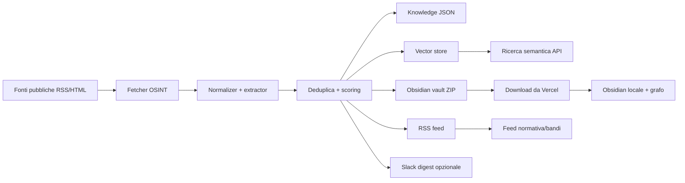

# RAGOSINT

[](https://rssmonitorbandi.vercel.app/)
[](https://rssmonitorbandi.vercel.app/feed/bandi.xml)
[](https://rssmonitorbandi.vercel.app/feed/normativa.xml)
[](https://rssmonitorbandi.vercel.app/api/brain.zip)
[](LICENSE)

## Minimum Viable Product

**Live MVP:** https://rssmonitorbandi.vercel.app/

RAGOSINT e' un sistema operativo OSINT/RAG per trasformare fonti pubbliche italiane in intelligence operativa: monitora normativa, bandi, gare d'appalto e PNRR, estrae segnali utili, pubblica due feed RSS e genera un brain Obsidian scaricabile per esplorare il grafo locale.

Questo non e' un semplice scraper: e' una pipeline viva che recupera fonti ufficiali, normalizza i contenuti, estrae scadenze/importi/CIG/CUP/requisiti/beneficiari, costruisce un vector store e rende tutto consultabile come feed, report, API semantica e vault Obsidian.

Provalo subito:

- MVP live: https://rssmonitorbandi.vercel.app/
- Feed bandi: https://rssmonitorbandi.vercel.app/feed/bandi.xml
- Feed normativa: https://rssmonitorbandi.vercel.app/feed/normativa.xml
- Brain Obsidian: https://rssmonitorbandi.vercel.app/api/brain.zip
- Ricerca semantica: https://rssmonitorbandi.vercel.app/api/semantic?q=pnrr%20cloud&channel=bandi

## Brain Obsidian esportabile

Il sistema genera una vault Obsidian completa in ZIP: scarichi il brain, lo apri in locale e navighi il grafo di bandi, normativa, fonti e tag.

[Scarica il brain Obsidian](https://rssmonitorbandi.vercel.app/api/brain.zip)



## Visione

RAGOSINT e' una pipeline OSINT/RAG-ready per un gruppo di ingegneri che vuole trasformare fonti pubbliche italiane in intelligence operativa.

## Canali RSS

- Normativa: `/feed/normativa.xml`
- Bandi: `/feed/bandi.xml`
- Aggregato: `/feed.xml`

Il feed **Normativa** serve per monitorare aggiornamenti giuridici e normativi che possono impattare appalti, PNRR, Pubblica Amministrazione, privacy, lavoro, digitale, regioni, regolamenti e giurisprudenza. Oggi raccoglie fonti ufficiali Gazzetta Ufficiale su Serie Generale, Corte Costituzionale, Unione Europea e Regioni.

## Aggiornamento feed RSS

I feed RSS si aggiornano automaticamente, ma il progetto non usa un database persistente: ogni feed viene generato dalla pipeline serverless quando viene richiesto.

Flusso attuale:

1. Un client apre un feed RSS:
   - `/feed/bandi.xml`
   - `/feed/normativa.xml`
   - `/feed.xml`
2. Vercel esegue la raccolta dalle fonti configurate, normalizza gli alert e genera l'XML RSS.
3. Il risultato viene tenuto in cache per 30 minuti:
   - `revalidate = 1800`
   - `s-maxage=1800`
4. Le chiamate verso le fonti esterne usano una cache fino a circa 1 ora.

In pratica gli aggiornamenti reali sono nell'ordine di 30-60 minuti, a seconda della cache Vercel e della disponibilita' delle fonti originali.

Esiste anche un cron Vercel giornaliero:

```json
{
  "path": "/api/refresh",
  "schedule": "0 6 * * *"
}
```

Questo cron chiama `/api/refresh` ogni giorno alle 06:00 UTC, cioe' circa alle 08:00 in Italia durante l'ora legale e alle 07:00 durante l'ora solare. Serve soprattutto a scaldare la pipeline e verificare i canali: non salva dati su database.

Refresh manuale:

```bash
curl "https://rssmonitorbandi.vercel.app/api/refresh"
```

Per un monitor piu' aggressivo si puo' passare a un cron orario:

```json
{
  "path": "/api/refresh",
  "schedule": "0 * * * *"
}
```

Le notifiche Slack possono essere collegate al refresh configurando `SLACK_WEBHOOK_URL` e `SLACK_NOTIFY_ON_REFRESH=true`.

## Obsidian brain scaricabile

Vercel genera una vault Obsidian completa in formato ZIP. Scaricala, estraila e apri la cartella con Obsidian per visualizzare grafo, tag, backlink, fonti e cluster.

- Brain completo: `/api/brain.zip`
- Brain normativa: `/api/brain/normativa.zip`
- Brain bandi: `/api/brain/bandi.zip`

Ogni ZIP contiene:

- note Markdown per alert, fonti, tag e canali;
- frontmatter YAML;
- link interni `[[...]]` per il grafo Obsidian;
- configurazione `.obsidian/` con grafo e plugin base.

API equivalenti:

- `/api/rss/normativa`
- `/api/rss/bandi`
- `/api/alerts?channel=normativa`
- `/api/alerts?channel=bandi`
- `/api/report?channel=normativa`
- `/api/search?q=cloud&channel=bandi`
- `/api/semantic?q=cloud%20software&channel=bandi`
- `/api/vector-store?channel=all`
- `/api/notify/slack?channel=bandi`

## Fonti iniziali

### Normativa

- Gazzetta Ufficiale - Serie Generale
- Gazzetta Ufficiale - Corte Costituzionale
- Gazzetta Ufficiale - Unione Europea
- Gazzetta Ufficiale - Regioni

### Bandi, gare e PNRR

- Gazzetta Ufficiale - 5a Serie Speciale Contratti Pubblici
- ANAC - Open Data Contratti Pubblici
- ANAC - Open Contracting Data Standard
- Acquisti in Rete PA - MEPA
- Italia Domani - Amministrazioni Titolari
- Italia Domani - Soggetti Attuatori
- PNRR Cultura - Bandi e Avvisi
- Regione Lombardia - Bandi
- START Toscana - Gare e Appalti
- Regione Toscana - Bandi di Gara e Contratti
- Universita di Bologna - Bandi
- Universita di Bologna - Portale Appalti
- Comune di Bologna - Bandi di Gara
- ESTAR Toscana - Consulta Gare
- AUSL Bologna - Bandi di Gara
- EuroHPC JU - AI Factories Access Calls
- EuroHPC JU - Supercomputers Access Calls
- EuroHPC JU - Research and Innovation Calls
- EuroHPC JU - AI for Science and Collaborative EU Projects
- IT4LIA AI Factory - Opportunita e servizi
- IT4LIA AI Factory - News
- IT4LIA AI Factory - Repository

La pipeline monitora anche opportunita europee HPC/AI: access call EuroHPC, AI Factories, bandi di ricerca e innovazione, grant collegati a Horizon Europe/Digital Europe e segnali IT4LIA utili per startup, PMI, PA, universita e ricerca.

Le fonti sono configurate in `src/data/sources.json`.

## Architettura



Il flow passa quindi anche da Obsidian: Vercel genera una vault Markdown pronta da scaricare, tu la apri in locale e visualizzi il grafo. La parte semantica resta esposta come API/Vercel e ogni nota del vault contiene un link alla ricerca semantica per trovare alert simili.

## Estrazione campi

Ogni alert viene arricchito con:

- scadenze e termini;
- importi;
- CIG;
- CUP;
- requisiti;
- soggetti beneficiari.

Questi campi finiscono in:

- JSON API;
- report Markdown;
- note Obsidian;
- vector store;
- ricerca semantica.

## Knowledge base

Lo script di ingest genera:

- `data/knowledge/items.json`
- `data/knowledge/bandi.json`
- `data/knowledge/normativa.json`
- `data/knowledge/index.json`
- `data/knowledge/vector-store.json`
- `brain/RAGOSINT - Index.md`
- `brain/RAGOSINT - Bandi.md`
- `brain/RAGOSINT - Normativa.md`

`data/knowledge/index.json` contiene chunk gia' pronti per un retriever. `data/knowledge/vector-store.json` contiene embeddings locali deterministici, dependency-free, utili come baseline per ricerca semantica e sostituibili in seguito con OpenAI embeddings, pgvector, Qdrant, Weaviate o altro vector database.

La vault scaricabile viene invece generata runtime da `src/lib/obsidian.ts` e compressa da `src/lib/zip.ts`, senza database e senza storage persistente.

## Ricerca semantica

Endpoint:

```bash
curl "https://rssmonitorbandi.vercel.app/api/semantic?q=pnrr%20cloud&channel=bandi"
curl "https://rssmonitorbandi.vercel.app/api/vector-store?channel=all"
```

Il modello `ragosint-hash-embedding-v1` e' una baseline locale: indicizza titolo, sintesi, tag e campi estratti. Serve per avere subito un vector store gratuito su Vercel; per produzione si puo' sostituire `src/lib/vector.ts` con embeddings esterni.

## Slack

Configurare su Vercel:

```bash
SLACK_WEBHOOK_URL=https://hooks.slack.com/services/...
SLACK_NOTIFY_SECRET=un-segreto-lungo
SLACK_NOTIFY_ON_REFRESH=false
```

Invio manuale:

```bash
curl "https://rssmonitorbandi.vercel.app/api/notify/slack?channel=bandi&secret=$SLACK_NOTIFY_SECRET"
```

Invio durante refresh:

```bash
curl "https://rssmonitorbandi.vercel.app/api/refresh?notify=slack&secret=$CRON_SECRET"
```

## Avvio locale

```bash
pnpm install
pnpm run ingest
pnpm run dev
```

## Verifiche

```bash
pnpm run typecheck
pnpm run lint
pnpm run build
```

## Deploy Vercel

Impostare:

```bash
NEXT_PUBLIC_SITE_URL=https://rssmonitorbandi.vercel.app
```

`vercel.json` contiene un cron giornaliero su `/api/refresh`, compatibile con il piano Hobby gratuito.

## Licenza

RAGOSINT e' rilasciato con licenza MIT. Puoi forkare, modificare, riusare e distribuire liberamente il progetto, mantenendo la nota di copyright e la licenza nei lavori derivati.

Vedi [LICENSE](LICENSE).

## Roadmap

- aggiungere parser dedicati per portali complessi ANAC/MEPA e singole centrali acquisto;
- sostituire gli embeddings locali con un provider embedding esterno quando serve ranking piu' fine;
- generare alert personalizzati per profili aziendali o aree di competenza;
- integrare notifiche Telegram o email oltre Slack.
